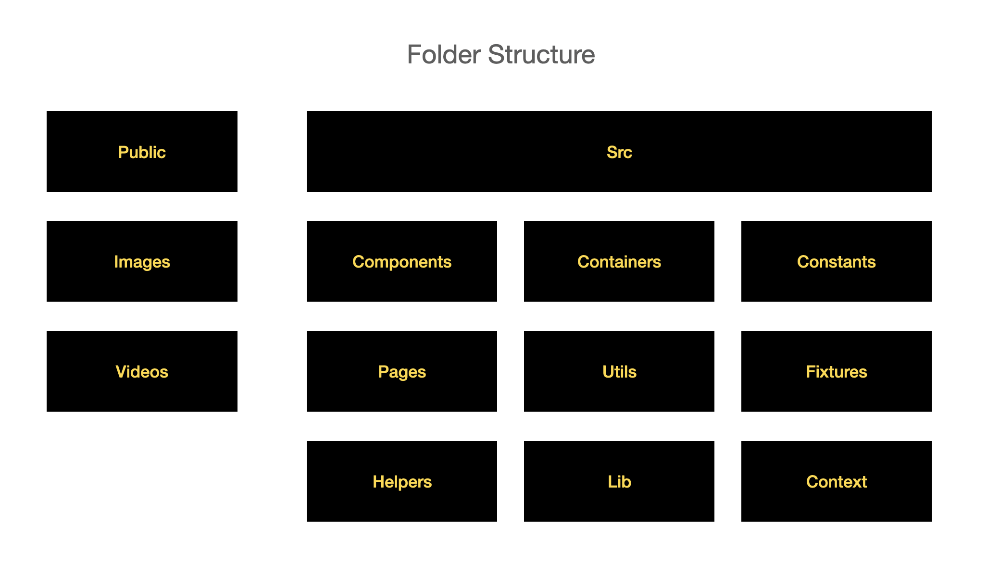
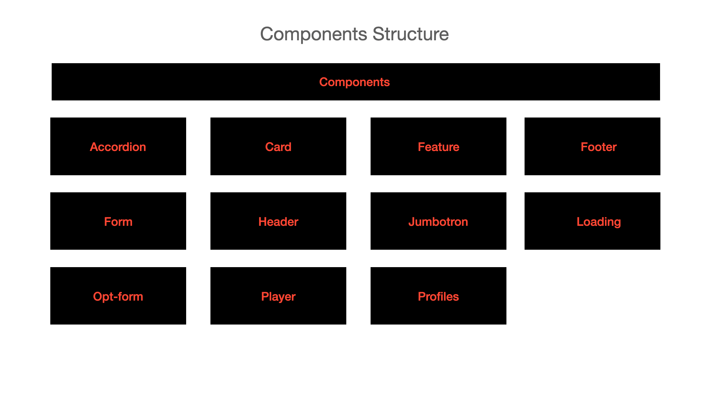
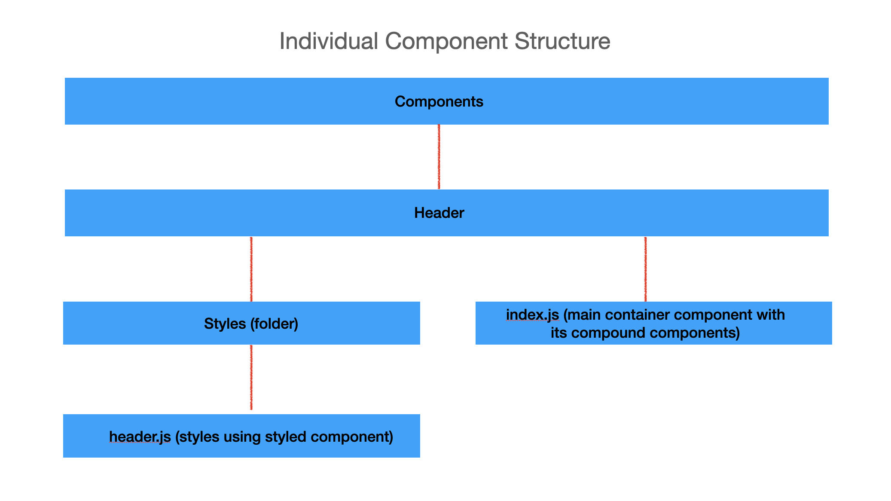
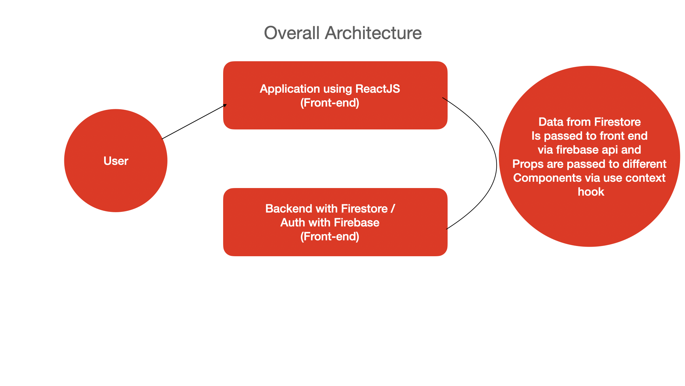

# Facile

## Content Page
  * [Description](#description)
  * [Motivation](#motivation)
  * [Features](#features)
  * [Approach](#approach)
  * [Technologies](#technologies)

### Description

Definition of Facile - Achieving something with ease/effortlessly

Facile is subscription based streaming platform for follow-along fitness workouts and coding tutorials.

---

### Motivation

##### Before enrolling in General Assembly, I used to self learn coding via tutorials on Udemy. 

However, the one time upfront payment for each individual courses meant I can’t back out even if the course is not for me. 

##### Why not Skillshare? 

Basically a short answer is the interface is confusing and everything coding related is themed under web dev, so its hard to find react or iOS dev tutorials specifically. 

##### What about fitness tutorials? 

During the COVID-19 lockdown period, I noticed lots of people searching for online follow along fitness workouts, and I kinda think it will be awesome to have a platform with a simple interface for users to access such videos easily. 

#### For Whom?

Coding tutorials for programmers of any languages or skill level looking to further increase their knowledge on their respective fields. 

People who prefer working out in their own private zones but are afraid/ do not like going to the gym. 

People who want to learn a new skill and want a simple platform to do so! Binge-watching is sure a good way to start!

---

### Features

1. User sign up/ sign in (Auth)
2. Select user profile (Mimicking Netflix)
3. Select category tab (Fitness/Coding for now).
4. Live search using Fuse.js
5. Video overlay using ReactPortal
6. Multiple episodes per video series.
7. Scrolling container when searching for videos similar to Netflix. 

#### App Demo:

### Approach

Step 1: Creating wireframes to visualize which components are needed/ how the layout/interface of the app looks like:

Step 2: Planning out folder structures, listing out components required and basic overall architecture overview:

Step 3: Begin coding 

---

### Technologies

##### ReactJS

1. React Routers for accessing different pages, i.e. signin/signout page, home page, browse page. 
2. React Hooks
3. ReactPortal for video player overlay.
4. styled components + compound components for reusable components/ styling. 

##### Firebase

1. Firebase for authentication and firestore for storing backend data & information

##### Misc.

1. Fuse.js
2. Styled-components
3. jest/ inbuilt react testing library for a few small tests

---

